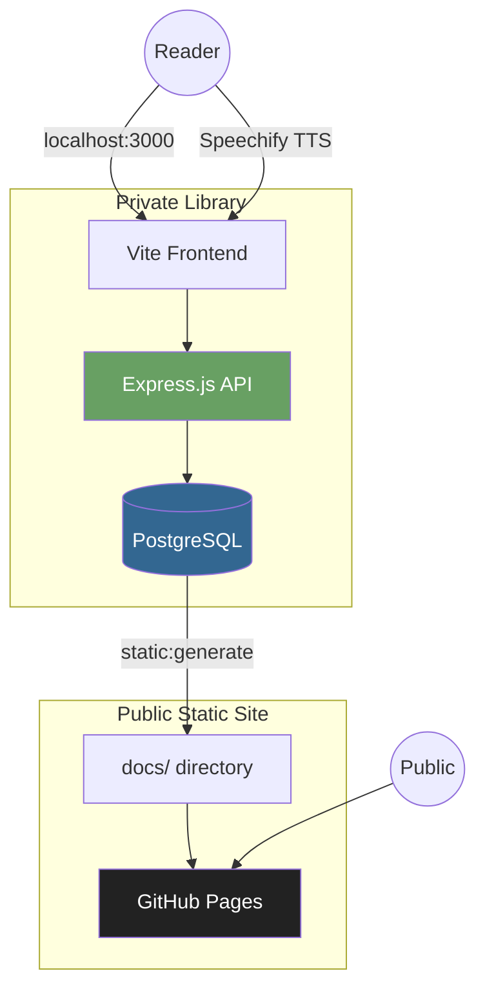
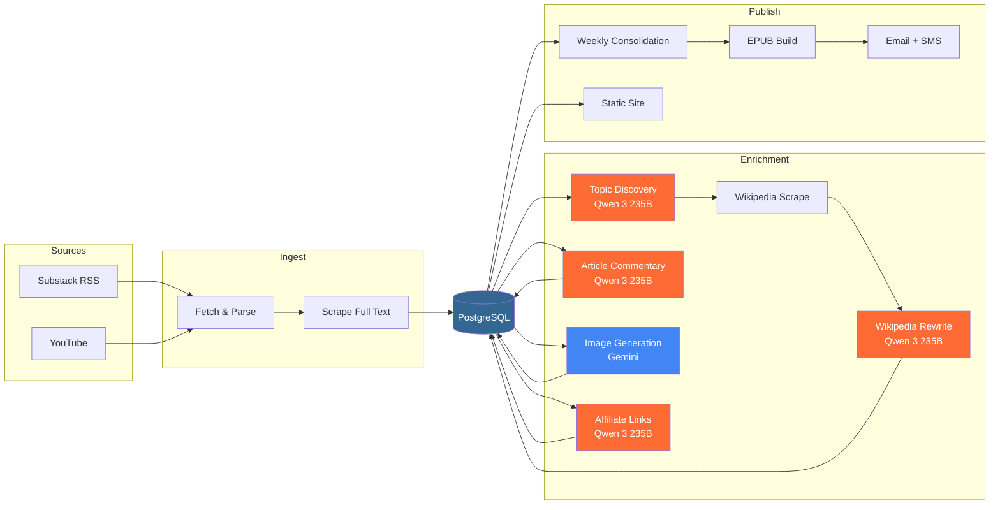

# Hex Index

A curated reading library that ingests Substack newsletters and YouTube transcripts, enriches them with Wikipedia context, and publishes as a weekly reader. Currently tracking **3,420 articles** from **292 publications** with **5,561 Wikipedia deep dives**.

**Live site**: [bedwards.github.io/hex-index](https://bedwards.github.io/hex-index/)

## Architecture

Two separate sites serve different purposes:



| | Private Library | Public Static Site |
|---|---|---|
| **Content** | Full articles | ~200 word excerpts |
| **Wikipedia** | Full rewrites | Full rewrites |
| **Search** | Full-text search | Client-side index |
| **Database** | PostgreSQL | None (static HTML) |
| **URL** | `localhost:3000` | GitHub Pages |

## Content Pipeline



## Schedule

All GPU-bound jobs use Qwen 3 235B via Ollama on a Mac Studio M4 Ultra. Jobs are staggered to avoid GPU contention:

```mermaid
gantt
    title Daily Job Schedule (repeating every 2 hours)
    dateFormat HH:mm
    axisFormat %H:%M

    section Even Hours
    Ingest + YT Ingest        :e1, 00:00, 5m
    Image Generation           :e2, 00:00, 30m
    Wiki Discover (Qwen)       :e3, 00:05, 25m
    Article Rewrite (Qwen)     :e4, 00:35, 25m

    section Odd Hours
    Wiki Rewrite (Qwen)        :o1, 01:05, 25m
    Affiliate Suggest (Qwen)   :o2, 01:35, 25m

    section Daily
    Claude Quality Guardian     :d1, 05:00, 30m

    section Weekly
    Build Weekly (Thu 23:00)   :w1, 23:00, 30m
    Send Weekly (Fri 07:30)    :w2, 07:30, 5m
```



```
GPU scheduling: Even hours run ingest + wiki-discover + article-rewrite
                Odd hours run wiki-rewrite + affiliate-suggest
                This prevents Qwen model swap thrashing on the 192GB unified memory
```

## Tech Stack

| Layer | Technology |
|---|---|
| API | Express.js 5 + TypeScript |
| Database | PostgreSQL (Docker) |
| Frontend | Vite 7 + TypeScript |
| Local LLM | Qwen 3 235B via Ollama |
| Quality | Claude Opus 4.6 (guardian) |
| Images | Google Gemini |
| Testing | Vitest, Playwright |
| Linting | ESLint + typescript-eslint |
| Notifications | Nodemailer, Twilio SMS |
| Static Site | GitHub Pages (`docs/`) |

## Quick Start

```bash
npm install
npm run db:up          # Start PostgreSQL in Docker
npm run db:migrate     # Run migrations
npm run dev            # Express API + Vite frontend
```

The private library runs at `localhost:3000`. HTTPS is configured in Vite for Speechify text-to-speech compatibility.

## Key Commands

```bash
# Development
npm run dev                    # API + frontend
npm run lint                   # ESLint (zero warnings policy)
npm run typecheck              # TypeScript check
npm run test                   # Vitest

# Pipeline jobs
npm run ingest                 # Fetch new articles from RSS
npm run job:yt-ingest          # Fetch YouTube transcripts
npm run job:wiki-discover      # Find Wikipedia topics for articles
npm run job:wiki-rewrite       # Rewrite Wikipedia articles
npm run job:article-rewrite    # Generate article commentary
npm run job:generate-images    # Generate article images (Gemini)
npm run job:affiliate-suggest  # Suggest Amazon affiliate links
npm run job:build-weekly       # Consolidate + build EPUB
npm run job:send-weekly        # Email + SMS the weekly reader

# Static site
npm run static:generate        # Generate docs/ from DB
npm run static:clean           # Clean and regenerate
npm run static:preview         # Preview at localhost:3000

# Database
npm run db:up                  # Start Postgres
npm run db:down                # Stop Postgres
npm run db:migrate             # Run migrations
```

## Service Management

Jobs run as `launchd` services managed by the [`svc` tool](https://github.com/bedwards/vibe/tree/main/sea-gang/tools/svc). A Postgres watchdog runs every 5 minutes to ensure the database stays up.

```bash
svc list                       # Show all services and schedules
svc logs <service>             # Tail service logs
svc run <service>              # Run a service immediately
```

## Project Structure

```
src/
  api/           Express routes and search
  db/            Migrations, queries, types
  feed/          RSS fetching and parsing
  ingestion/     Article ingestion pipeline
  scraper/       Substack content scraper
  wikipedia/     Topic analysis, scraping, rewriting
  frontend/      Vite app (HTML, CSS, TS)
tools/
  jobs/          Pipeline job scripts
  cron/          Shell wrappers for launchd
  static-site/   GitHub Pages generator
  discord/       Team notifications
  github/        Issue and PR tools
content/
  ingest-subscribed.json    Substack RSS sources
  youtube-sources.json      YouTube channels
  affiliate-books.json      Book affiliate data
docs/            Generated static site (GitHub Pages)
```
